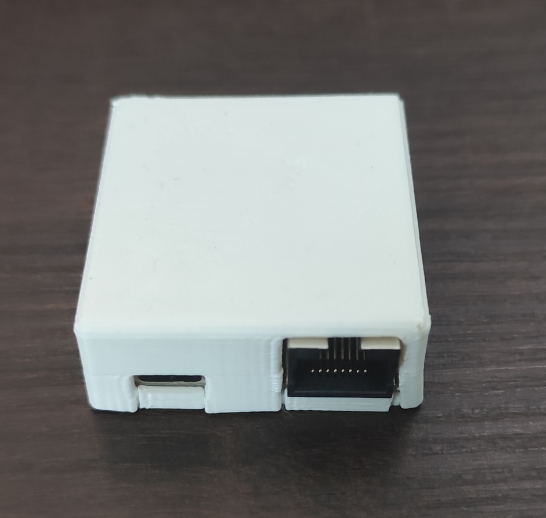
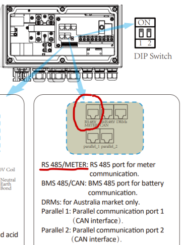

# esphome-deye-lite

**Local Modbus monitoring and smart export control for Deye hybrid inverters developed in ESPHome.**

> ESP32-based module that connects to your Deye inverter's RS485 Modbus port and reads inverter data every 5 seconds. The built-in web interface is accessible from any browser on your local network.
Connecting it to Home Assistant adds live dashboards and energy monitoring.
Since the module is a generic RS485-to-Wi-Fi bridge, it can be adapted for other Modbus devices beyond Deye inverters.
Feel free to extend the firmware to suit your needs.

---

## Contents

- [The overvoltage problem](#the-overvoltage-problem)
- [What it does](#what-it-does)
- [Hardware](#hardware)
- [Software](#software)
- [Setup](#setup)
- [How to use](#how-to-use)
- [Sensors](#sensors)
- [Troubleshooting](#troubleshooting)
- [Compatibility](#compatibility)
- [License](#license)

---

## The overvoltage problem

When multiple prosumers share the same transformer, the grid voltage rises to a point that keeps inverters in an injection and error loop. House appliances then see voltage swinging abruptly from 255 V while exporting to 230 V in island mode, when the inverter disconnects from the grid due to high voltage.

## What it does

The module reads your Deye inverter's internal registers over Modbus RS485 and makes the data available locally via a built-in web interface.

It reports:

- **Solar production:** PV1 and PV2 power, voltage, current; daily and total yield
- **Grid:** power (import/export), voltage; daily and total bought/sold energy
- **Battery:** (if present) state of charge, power, current, voltage, temperature; daily and total charge/discharge energy
- **House load** *(backup output only)*: real-time consumption power; daily and total energy
- **Inverter health:** DC and AC temperatures

Fast sensors update every 5 seconds. Energy totals and temperatures update every 60 seconds.

The module also includes the **SmartInject** feature, an automatic export voltage control algorithm that prevents grid overvoltage faults during solar export. See [Software](#software) for details.

Natively compatible with Home Assistant as it is built using ESPHome.

---

## Hardware

The module is an ESP32 with an RS485 transceiver and bus protection circuitry.



### Wiring

#### Data connection

> [!WARNING]
> Connecting the cable requires opening the inverter's side panel, which exposes live mains connections. **Power off and disconnect the inverter from the grid before opening it.** Route the Ethernet cable through one of the inverter's cable glands — unscrew it, pass the cable through, then re-tighten the gland before closing the panel.

Connect the module to your Deye inverter's **Modbus RS485 port** via a standard Ethernet patch cable. Check your inverter manual for the correct port and pinout before connecting — it varies by model.

On the **SUN-6K-SG03LP1-EU**, plug into the **RS485/METER** RJ45 port.



The module's RJ45 pinout matches the SUN-6K-SG03LP1-EU connector:

| Pin | Wire colour | Signal |
|-----|-------------|--------|
| 4 | White/Blue | RS485 B |
| 5 | Blue | RS485 A |

> This module does not provide a ground connection on the RS485 bus as it is not supported by the inverter itself.

If your inverter uses a different pinout, terminate your own patch cable using the blue pair for A/B RS485 lines.

#### Power

Plug a USB-C power supply into the module's USB-C port.
Any 500 mA capable 5 V PSU is suitable — the module draws about 150 mA.
Use a quality power supply; chargers with poor mains isolation can damage the inverter.

---

## Software

### SmartInject: export voltage control

#### The problem it solves

When your solar panels produce more than your home can consume, your inverter pushes the surplus to the grid. Since more and more homes do the same, the local grid voltage rises. When it rises above the inverter's protection threshold, your inverter trips an **overvoltage fault** and islands itself to stop exporting, sometimes repeatedly throughout the day.

Deye inverters have a built-in **Max Sell Power** setting that caps grid export, but it is a fixed value and cannot react to what the grid is actually doing at any moment. SmartInject makes that limit dynamic.

#### How it works

SmartInject watches the grid voltage reading (updated every 5 seconds) and adjusts the Max Sell Power limit automatically:

- **No PV (< 1 W):** nothing to regulate; algorithm skips
- **Low PV (< 100 W):** limit resets to 1000 W so the system starts fresh each morning
- **Voltage above threshold (≥ 253 V) and currently exporting:** limit steps down proportionally
  - 253–254 V: −250 W
  - 254–255 V: −500 W
  - above 255 V: −1000 W
  - Floor: 500 W (never cuts export entirely)
- **Voltage OK and grid can take it:** limit rises by 250 W (up to the full 6000 W)

After every adjustment an **injection ceiling clamp** runs: the limit is capped to `actual export + 500 W` to prevent voltage spikes — for example, when the battery finishes charging and the inverter suddenly has excess power available.

#### What SmartInject does not do (trade-offs)

SmartInject is not an inject power optimiser. It is mostly a protection algorithm. It keeps your appliances from seeing voltage swing between 255 V and 230 V every few minutes. It only ever writes to the **Max Sell Power** register and does not touch battery charge/discharge settings, time-of-use schedules, or any other inverter configuration.

When voltage is too high, it reduces your export to prevent a fault trip that stops export entirely, at the cost of some export yield.

---

## Setup

> **Credentials:** the hotspot password, API encryption key, web username, and web password are all available via the QR code printed on the label on the module. You are free to change them by reflashing the firmware over OTA.

### 1. First boot and Wi-Fi

1. Power the module via the USB-C cable.
2. Within about 10 seconds the module broadcasts a Wi-Fi hotspot named **`Deye-Lite Fallback Hotspot`**.
3. Connect your phone to the hotspot using the **hotspot** on the module label.
4. A captive portal opens automatically. If it doesn't, navigate to `192.168.4.1` in your browser.
5. Select your home Wi-Fi network name and password and tap **Save**.
6. The module reboots and connects to your network. The hotspot disappears.
7. Use the mDNS hostname or the module's IP address to access the inverter data from your browser.

> The fallback hotspot reappears any time the module cannot reach a known Wi-Fi network, for example after a router change. Re-run the above steps to reconfigure in case you ever change your Wi-Fi password.

### 2. Adding to Home Assistant *(optional)*

Once the module is on your network, Home Assistant will detect it automatically via mDNS.

1. In Home Assistant, go to **Settings → Devices & Services**.
2. You should see a new ESPHome device discovered. Click **Configure**.
3. Enter the **API encryption key** from the module label. The key is long — scan the QR code and paste it to avoid errors.
4. Click **Submit**. All entities are added immediately.

> If the device is not discovered automatically after a minute or two, go to **Settings → Devices & Services → Add Integration → ESPHome** and enter the module's IP address manually. Use a scanning app to find it.

### 3. OTA firmware updates *(optional)*

All firmware updates are pushed over Wi-Fi.

**Via ESPHome dashboard** (recommended):
- The [ESPHome device builder](https://esphome.io/guides/getting_started_hassio.html) is available as a Home Assistant add-on or as a [standalone desktop application](https://esphome.io/guides/getting_started_command_line.html). The module advertises itself via mDNS and will appear automatically as an adopted device. Click **Install** to compile and push the update wirelessly.

**Via the web interface:**
- The built-in web server provides a firmware upload page accessible from your browser. No ESPHome installation required, though it is needed to compile the firmware from source.

---

## How to use

### Web interface

The module runs a local web server on port 80. Access it from any browser on your network:
```
http://deye-lite-<last 6 digits of MAC>.local
```
Or use the module's IP address directly if mDNS is not available on your network.

**Username / Password:** scan the QR code on the label.

The web interface shows all live sensor values and lets you:
- Toggle the SmartInject switch (defaults to on after a restart)
- Adjust the Max Sell Power limit manually (only effective when SmartInject is off)
- Trigger a remote restart

This works without Home Assistant.

### Home Assistant entities

Once adopted, all sensors appear automatically as entities named `deye-lite-<MAC>_<sensor>`. The MAC-based suffix ensures no conflicts if you have multiple modules on the same network.

#### Energy dashboard

The module maps directly into the **Home Assistant Energy dashboard** (**Settings → Energy**). Recommended slots for a typical setup:

| HA Energy slot | Entity | Notes |
|---|---|---|
| Solar production | `..._Total_PV_Prod` | |
| Grid consumption | `..._Total_Energy_Bought` | |
| Grid return | `..._Total_Energy_Sold` | |
| Battery in *(optional)* | `..._Total_Batt_Chg` | only if battery fitted |
| Battery out *(optional)* | `..._Total_Batt_Dchg` | only if battery fitted |

> Your actual entity names include your module's MAC suffix. Check your device page in Home Assistant for the exact names.

### SmartInject switch

SmartInject is **on by default**. Toggle the `SmartInject` switch entity in Home Assistant or the web interface to enable or disable it at any time. When disabled, the Max Sell Power value stays at whatever it was last set to. It is not reset automatically.

### Max Sell Power

The `Max_Sell_Power` number entity shows the export limit currently set on the inverter (in watts) and lets you override it manually. SmartInject writes to this same value. If SmartInject is on, any manual value you set will be overwritten on the next voltage reading. If you want to remove the module and put the inverter in the state before adding the module, disable SmartInject, set the value to 6000, then power off and disconnect the module from the inverter.

---

## Sensors

| Entity | Unit | Update interval |
|---|---|---|
| PV1 Power | W | 5 s |
| PV2 Power | W | 5 s |
| PV Power (total) | W | 5 s |
| PV1 / PV2 Voltage | V | 60 s |
| PV1 / PV2 Current | A | 60 s |
| Daily PV Production | kWh | 60 s |
| Total PV Production | kWh | 60 s |
| Grid Power | W | 5 s |
| Grid Voltage | V | 5 s |
| Daily Energy Bought / Sold | kWh | 60 s |
| Total Energy Bought / Sold | kWh | 60 s |
| House Power | W | 5 s |
| Daily / Total House Energy | kWh | 60 s |
| Battery SOC | % | 60 s |
| Battery Power | W | 5 s |
| Battery Current | A | 60 s |
| Battery Voltage | V | 60 s |
| Battery Temperature | °C | 60 s |
| DC Temperature | °C | 60 s |
| AC Temperature | °C | 60 s |
| Max Sell Power | W | writable |

---

## Troubleshooting

**Module not appearing in Home Assistant after first boot**
- Confirm the module joined your Wi-Fi (check your router's client list for a device starting with `deye-lite-`)
- If it's not connected, the fallback hotspot should be active; re-run the captive portal
- Try adding the integration manually via IP address

**All sensors show `unavailable`**
- Check RS485 wiring — A and B lines may be swapped; try reversing them
- Confirm Modbus is enabled on the inverter; refer to your inverter's manual for the correct setting

**SmartInject is not adjusting the export limit**

First confirm the `SmartInject` switch is on and that `Grid Voltage` and `PV Power` are showing valid readings — the algorithm only runs when both are available. If those look correct but Max Sell Power stays fixed, your inverter model may use a different register address; check the compatibility notes below.

**Fallback hotspot not appearing**

Power-cycle the module and wait up to 30 seconds. The hotspot will not appear if the module is still trying to connect to a previously configured network.

**Web interface not reachable**

Try the IP address directly instead of the `.local` hostname. Some Android devices do not resolve mDNS; find the IP in your router's DHCP client list or use a network scanning app.

---

## Compatibility

Tested on Deye single-phase hybrid inverters (SUN-xK-SG series). Register addresses follow the standard Deye/Sunsynk/Sol-Ark Modbus map and are expected to work on compatible inverters from those families, but this is not guaranteed for all models and firmware versions.

If your inverter uses a different register address for Max Sell Power than register 245, SmartInject will need to be adjusted accordingly.

---

## License

MIT. See [LICENSE](LICENSE).
